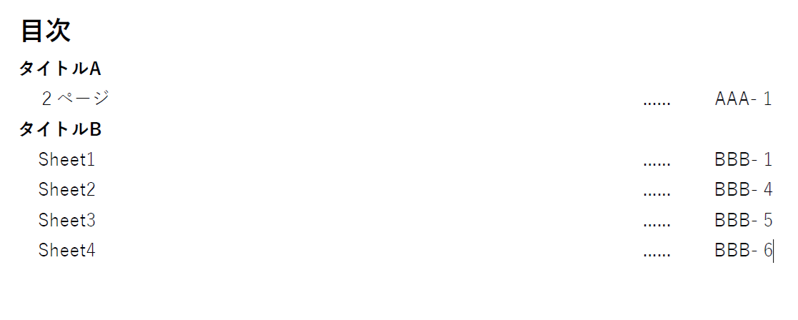

# 複数Excelシート目次作成ツール

## オーバービュー

- 複数のシートがあるExcelに対して目次をExcelで作成します。
  - サンプルの目次です
    
- [使い方の説明](doc/readme.pptx)

## ファイル

- [Excel目次作成ツール](src/Excel目次作成ツール.xlsm)
- 目次をつくるための対象ファイル
  - [aaa.xlsx](doc/aaa.xlsx)
  - [bbb.xlsx](doc/bbb.xlsx)
- 出力例のサンプル
  - [目次.xlsx](out/目次.xlsx)

## 技術的なこと

- ここは githubです。技術的な説明をちょっとだけします。
  - [Excelで「開発ボタン」が押せるようにする](https://support.microsoft.com/ja-jp/office/-%E9%96%8B%E7%99%BA-%E3%82%BF%E3%83%96%E3%82%92%E8%A1%A8%E7%A4%BA%E3%81%99%E3%82%8B-e1192344-5e56-4d45-931b-e5fd9bea2d45)
  - [Excelで「参照設定」ができるようにする](https://learn.microsoft.com/ja-jp/office/vba/language/reference/user-interface-help/references-dialog-box)
  - その他、ソースコードについて
    - Excelファイルを開いた後、「開発」→「Visual Basic」で参照してください。

